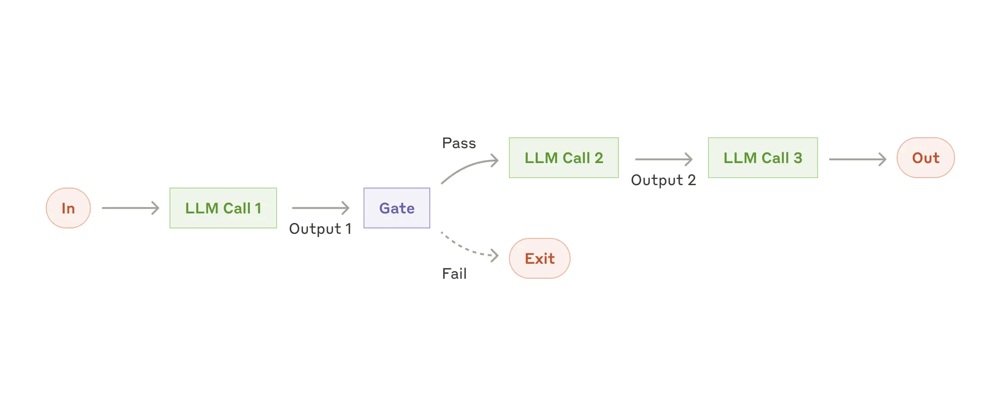
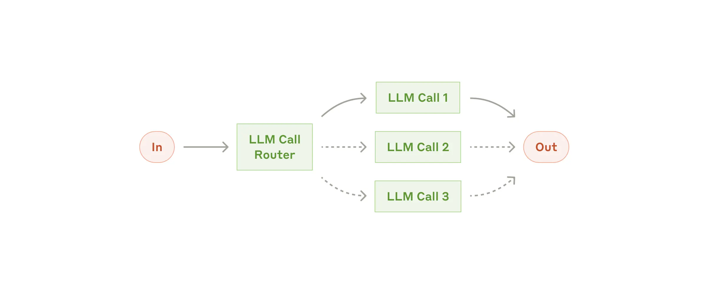
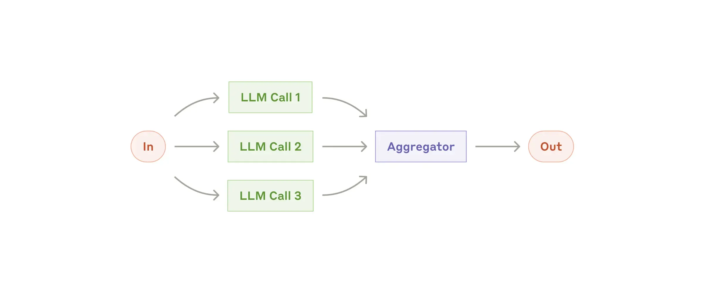
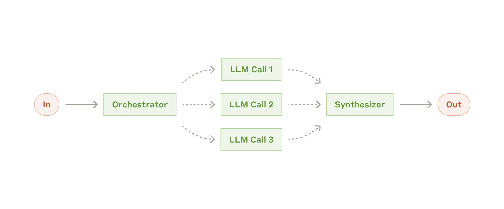
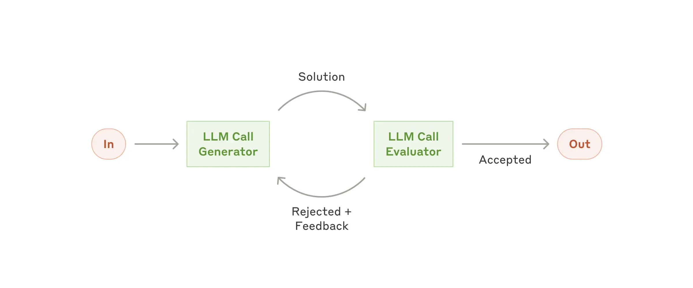
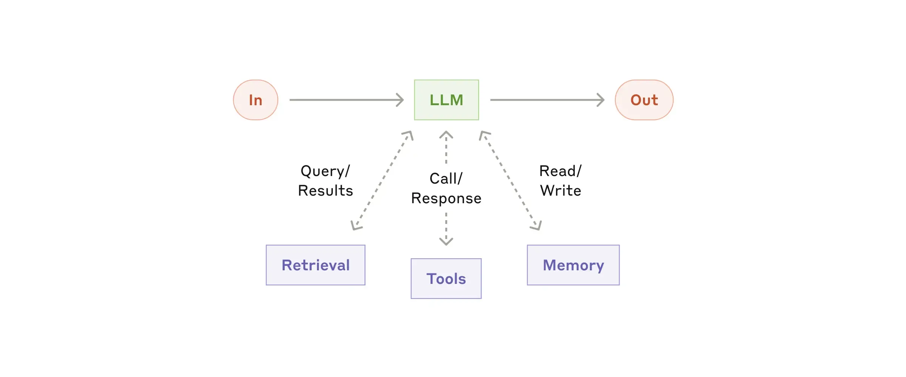

# Agentic AI Workflow – Monorepo Guide

This repository contains multiple independent AI-powered Spring Boot applications, each demonstrating a unique agentic workflow or integration. Each module is self-contained and can be run individually using Docker Compose. This guide provides a detailed overview of each module, their functionality, environment configuration, and API documentation.

---

## Table of Contents

1. [Repository Structure](#repository-structure)
2. [Common Setup Requirements](#common-setup-requirements)
3. [Module Overviews & API Docs](#module-overviews--api-docs)
    - [agent-workflow-architecture](#agent-workflow-architecture)
    - [ai-agents-bedrock](#ai-agents-bedrock)
    - [ai-agents-google-adk](#ai-agents-google-adk)
    - [ai-agents-ollama](#ai-agents-ollama)
4. [Module Execution Guidelines](#module-execution-guidelines)
5. [Troubleshooting](#troubleshooting)

---

## Repository Structure

```
agentic-ai-workflow/
│
├── agent-workflow-architecture/   # Agentic workflow design patterns
├── ai-agents-bedrock/             # AWS Bedrock-powered dog adoption assistant
├── ai-agents-google-adk/          # Google ADK-powered travel assistant
├── ai-agents-ollama/              # Ollama LLM-powered wine assistant
├── Dockerfile
├── README.md
└── ...
```

---

## Common Setup Requirements

- **Docker Desktop** (latest)
- **Docker Compose**
- **Java 21** (for local builds)
- **Maven** (for local builds)
- **Git**
- **.env file**: Each module requires a `.env` file in its root directory for environment-specific configuration.

---

## Module Overviews & API Docs

### 1. agent-workflow-architecture

**Purpose:**  
Demonstrates various agentic workflow patterns (chain, routing, parallelization, orchestration, evaluation/optimization) using Spring Boot. This is a reference implementation for building complex AI agent workflows.

**Key Features:**
- Multiple workflow patterns implemented as Java classes
- REST API for workflow orchestration
- Configurable via environment variables

**API Documentation:**

| Endpoint                                 | Method | Description                                                                                  |
|-------------------------------------------|--------|----------------------------------------------------------------------------------------------|
| `/workflow/chain`                        | GET    | Runs the chain workflow on a sample report and returns the result.                           |
| `/workflow/route/{incidentId}`           | GET    | Runs the routing workflow for a given incident ID.                                           |
| `/workflow/parallel`                     | GET    | Runs the parallelization workflow for multiple stakeholder groups and returns the results.    |
| `/workflow/orchestrate`                  | GET    | Runs the orchestrator workflow to generate a product description.                            |
| `/workflow/evaluate/optimize`            | GET    | Runs the evaluator/optimizer workflow on a sample coding task and returns the refined result.|

#### Workflow diagrams

- **Chain Workflow**



- **Routing Workflow**



- **Parallelization Workflow**



- **Orchestrator Workflow**



- **Evaluator/Optimizer Workflow**



- **Augmented LLM Pattern**



---

### 2. ai-agents-bedrock

**Purpose:**  
An AI-powered dog adoption assistant leveraging AWS Bedrock for LLM and PGVector for vector search. Helps users find adoptable dogs using natural language queries.

**Key Features:**
- Conversational AI for dog adoption
- Vector store (PostgreSQL + pgvector) for semantic search
- Integration with AWS Bedrock for embeddings and LLM
- REST API for user queries
- **Appointment Scheduling:** Demonstrates scheduling appointments for dog adoption through integration with an MCP server, enabling end-to-end adoption workflows.

**API Documentation:**

| Endpoint                                 | Method | Description                                                                                  |
|-------------------------------------------|--------|----------------------------------------------------------------------------------------------|
| `/{user}/adoption/enquiry?question=...`  | GET    | Asks a question about dog adoption for a specific user. Uses LLM and vector search.          |

---

### 3. ai-agents-google-adk

**Purpose:**  
A travel assistant agent using Google ADK (Agent Development Kit). Provides travel recommendations and planning via conversational interface.

**Key Features:**
- Google ADK integration for LLM
- REST API for travel queries
- Modular agent configuration
- **Weather and Search Integration:** Integrates a weather MCP server and a Google Search agent to help plan a day in a city, combining real-time weather data and search results for comprehensive travel planning.

**API Documentation:**

| Endpoint                                 | Method | Description                                                                                  |
|-------------------------------------------|--------|----------------------------------------------------------------------------------------------|
| `/{user}/travel/plan?question=...`       | GET    | Asks a travel planning question for a specific user. Integrates weather and search agents.   |

#### Get a free Google API key (Google AI Studio)

1. Open the Google AI Studio API key page: [Google AI Studio](https://aistudio.google.com/apikey)
2. Sign in with your Google account.
3. Click "Create API key" and follow the prompt to generate a key.
4. Copy the key. Treat it like a secret.
5. In the module root `ai-agents-google-adk/`, create a `.env` file (if it doesn't exist) and add:

```env
GOOGLE_API_KEY=your-google-api-key
```

6. Start the module: `cd ai-agents-google-adk && docker compose up --build`

Notes:
- **Free tier** is available but subject to quota and regional availability. Usage may incur costs beyond free limits.
- Do not commit `.env` to version control.

---

### 4. ai-agents-ollama

**Purpose:**  
A wine recommendation and information assistant powered by Ollama LLM and ChromaDB for vector search. Demonstrates advanced agent builder features for domain-specific queries.

**Key Features:**
- Ollama LLM integration
- Wine data loaded from CSV
- REST API for wine queries
- **Agent Builder Demonstration:** Showcases key features such as:
  - **Chat:** Conversational interface
  - **Vector Search:** Semantic search over wine data
  - **Tools:** Custom tools for enhanced agent capabilities
  - **Structured Output:** LLM response with structured output
  - **RAG (Retrieval-Augmented Generation):** Combines LLM with vector search for context-aware answers
  - **Guardrails:** Implements safety and control mechanisms for agent responses

**API Documentation:**

| Endpoint                                 | Method | Description                                                                                  |
|-------------------------------------------|--------|----------------------------------------------------------------------------------------------|
| `/{user}/ai/chat?message=...`            | GET    | Conversational chat with the LLM for a specific user.                                        |
| `/ai/chroma?message=...`                 | GET    | Vector search for wines based on a query.                                                    |
| `/ai/chroma/meta?search_query=...&meta_query=...` | GET | Vector search for wines with metadata filtering.                                             |
| `/{user}/ai/tool/call?message=...`       | GET    | Calls a custom wine tool for recommendations.                                                |
| `/{user}/ai/structure?message=...`       | GET    | Returns structured wine details for a query.                                                 |
| `/{user}/ai/rag?message=...`             | GET    | Retrieval-Augmented Generation: combines LLM and vector search for answers.                  |
| `/{user}/ai/guardrail?message=...`       | GET    | Chat with guardrails (safety filters) enabled.                                               |

---

## Module Execution Guidelines

### How to run each module

Run from the respective module directory:

```bash
cd ai-agents-bedrock && docker compose up --build
```

```bash
cd ai-agents-ollama && docker compose up --build
```

Note for first-time startup in `ai-agents-ollama`:
- The `ollama` container downloads and warms up required models on first run via `scripts/ollama-init.sh`. If all services start at once, the app may fail because Ollama hasn't finished startup.
- Recommended sequence for the very first run (or after purging volumes):
  1. Temporarily comment out the `chromadb` and `ai-agents-ollama` services in `ai-agents-ollama/docker-compose.yml`, leaving only the `ollama` service.
  2. Start only Ollama: `docker compose up --build` and wait until the logs show models are pulled and the server is ready.
  3. Stop the compose (`Ctrl+C`), restore the commented services, and then start all services: `docker compose up --build`.
  4. Keep `VECTORSTORE_INITIALIZE` aligned with the guidance below to control ingestion.

```bash
cd ai-agents-google-adk && docker compose up --build
```

```bash
cd agent-workflow-architecture && docker compose up --build
```

### .env prerequisites

Each module expects a `.env` file in its root directory. This file is used by Docker Compose to inject environment variables into the containers.

- Create a `.env` file per module directory.
- Populate it with the required credentials and configuration for that module.

Examples:

```env
# ai-agents-bedrock/.env
AWS_ACCESS_KEY=your-access-key
AWS_SECRET_KEY=your-secret-key
AWS_SESSION_TOKEN=your-session-token
```

```env
# ai-agents-google-adk/.env
GOOGLE_API_KEY=your-google-api-key
```

```env
# agent-workflow-architecture/.env
OPENAI_API_KEY=your-openai-api-key
```

### ai-agents-ollama and ai-agents-bedrock: one-time vector store initialization

Both `ai-agents-ollama` (ChromaDB) and `ai-agents-bedrock` (PostgreSQL + pgvector) require a one-time ingestion/initialization of their vector stores. This is controlled by the `VECTORSTORE_INITIALIZE` environment variable, which maps to `app.vectorstore.initialize` in Spring configuration.

- **First run:** Set `VECTORSTORE_INITIALIZE=true` to load data into the vector store.
- **Subsequent runs:** Set `VECTORSTORE_INITIALIZE=false` to prevent re-ingestion on every startup.
- **After purging volumes:** If you remove Docker volumes and restart, set `VECTORSTORE_INITIALIZE=true` again to reinitialize.

Where to set it:
- `ai-agents-bedrock/docker-compose.yml` currently sets `VECTORSTORE_INITIALIZE=true` by default for the first run. Change it to `false` after initialization completes.
- `ai-agents-ollama/docker-compose.yml` sets `VECTORSTORE_INITIALIZE=false` by default. Change it to `true` only for the first run (or after purging volumes), then revert to `false`.

Example snippets:

```yaml
# ai-agents-bedrock/docker-compose.yml
  ai-agents-bedrock:
    environment:
      - VECTORSTORE_INITIALIZE=true   # First run only; set to false afterwards
```

```yaml
# ai-agents-ollama/docker-compose.yml
  ai-agents-ollama:
    environment:
      - VECTORSTORE_INITIALIZE=true   # First run only; set to false afterwards
```

Notes:
- Schema initialization is managed separately via `initialize-schema: true` in each module's `application.yml`. The `VECTORSTORE_INITIALIZE` flag specifically controls data ingestion/population.
- For a full reset, purge volumes and re-run with initialization enabled:
  - Bedrock: run inside `ai-agents-bedrock/`: `docker compose down -v`
  - Ollama/Chroma: run inside `ai-agents-ollama/`: `docker compose down -v`

### Swagger / OpenAPI

Once a module is running on port 8080, API docs are available at:
- Swagger UI: `http://localhost:8080/swagger-ui/index.html`
- OpenAPI JSON: `http://localhost:8080/v3/api-docs`

---

## Troubleshooting

- **Build Issues:**  
  Use `docker compose down -v` to remove old containers/volumes, then rebuild.

- **Environment Variables Not Loaded:**  
  Ensure `.env` exists and is in the correct directory.

- **Database Connection Errors:**  
  Check DB credentials and that the DB service is running.

- **AWS/Google/Ollama API Errors:**  
  Verify your API keys and network access.

---